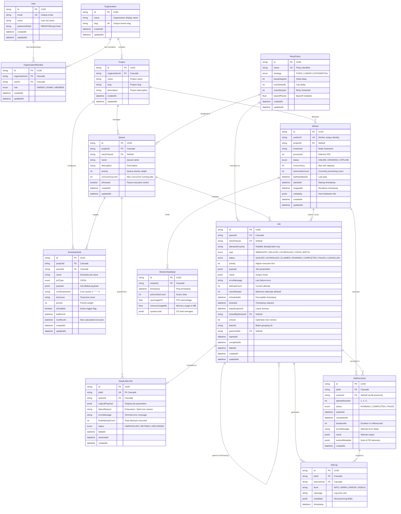

# Entity-Relationship (ER) Diagram

The following Mermaid diagram maps all 13 database entities, primary keys, foreign keys, cardinality, and cascade boundaries for the Distributed Job Scheduler.

```mermaid
erDiagram
    User ||--o{ OrganizationMember : "has memberships"
    Organization ||--o{ OrganizationMember : "has members"
    Organization ||--o{ Project : "contains"
    Project ||--o{ Queue : "manages"
    Project ||--o{ ScheduledJob : "configures"
    Project ||--o{ Worker : "allocates"

    RetryPolicy ||--o{ Queue : "assigned to"
    RetryPolicy ||--o{ Job : "overrides on"

    Queue ||--o{ Job : "contains"
    Queue ||--o{ ScheduledJob : "targets"
    Queue ||--o{ DeadLetterJob : "quarantines"

    Worker ||--o{ WorkerHeartbeat : "emits"
    Worker ||--o{ Job : "claims / locks"
    Worker ||--o{ JobExecution : "executes"

    Job ||--o{ Job : "parent of (hierarchy)"
    Job ||--o{ JobExecution : "recorded in"
    Job ||--o{ JobLog : "generates"
    Job ||--o| DeadLetterJob : "escalates to"

    JobExecution ||--o{ JobLog : "scoped to"

    User {
        string id PK "UUID"
        string email UK "Unique email"
        string name "User full name"
        string passwordHash "PBKDF2/Bcrypt hash"
        datetime createdAt
        datetime updatedAt
    }

    Organization {
        string id PK "UUID"
        string name "Organization display name"
        string slug UK "Unique tenant slug"
        datetime createdAt
        datetime updatedAt
    }

    OrganizationMember {
        string id PK "UUID"
        string organizationId FK "Cascade"
        string userId FK "Cascade"
        enum role "OWNER | ADMIN | MEMBER"
        datetime createdAt
        datetime updatedAt
    }

    Project {
        string id PK "UUID"
        string organizationId FK "Cascade"
        string name "Project name"
        string slug "Project slug"
        string description "Project description"
        datetime createdAt
        datetime updatedAt
    }

    RetryPolicy {
        string id PK "UUID"
        string name UK "Policy identifier"
        enum strategy "FIXED | LINEAR | EXPONENTIAL"
        int baseDelayMs "Initial delay"
        int maxDelayMs "Cap delay"
        int maxAttempts "Retry threshold"
        float backoffFactor "Backoff multiplier"
        datetime createdAt
        datetime updatedAt
    }

    Queue {
        string id PK "UUID"
        string projectId FK "Cascade"
        string retryPolicyId FK "SetNull"
        string name "Queue name"
        string description "Description"
        int priority "Queue priority weight"
        int concurrencyLimit "Max concurrent running jobs"
        boolean isPaused "Pause execution switch"
        datetime createdAt
        datetime updatedAt
    }

    Job {
        string id PK "UUID"
        string queueId FK "Cascade"
        string retryPolicyId FK "SetNull"
        string idempotencyKey "Nullable deduplication key"
        enum type "IMMEDIATE | DELAYED | SCHEDULED | CRON | BATCH"
        enum status "QUEUED | SCHEDULED | CLAIMED | RUNNING | COMPLETED | FAILED | CANCELLED"
        int priority "Higher executes first"
        jsonb payload "Job parameters"
        jsonb result "Output result"
        string errorMessage "Last failure error"
        int attemptCount "Current attempt"
        int maxAttempts "Maximum attempts allowed"
        datetime scheduledAt "Executable timestamp"
        datetime lockedAt "Timestamp claimed"
        datetime leaseExpiresAt "Lease timeout"
        string lockedByWorkerId FK "SetNull"
        int version "Optimistic lock version"
        string batchId "Batch grouping ID"
        string parentJobId FK "SetNull"
        datetime startedAt
        datetime completedAt
        datetime failedAt
        datetime createdAt
        datetime updatedAt
    }

    JobExecution {
        string id PK "UUID"
        string jobId FK "Cascade"
        string workerId FK "SetNull (Audit preserve)"
        int attemptNumber "1, 2, 3..."
        enum status "RUNNING | COMPLETED | FAILED"
        datetime startedAt
        datetime completedAt
        int durationMs "Duration in milliseconds"
        string errorMessage "Attempt error detail"
        jsonb result "Attempt output"
        jsonb workerMetadata "Host & PID telemetry"
        datetime createdAt
    }

    JobLog {
        string id PK "UUID"
        string jobId FK "Cascade"
        string executionId FK "Cascade"
        string level "INFO | WARN | ERROR | DEBUG"
        string message "Log entry text"
        jsonb metadata "Structured log fields"
        datetime timestamp
    }

    Worker {
        string id PK "UUID"
        string workerId UK "Worker unique identity"
        string projectId FK "SetNull"
        string hostname "Node hostname"
        int processId "Daemon PID"
        enum status "ONLINE | DRAINING | OFFLINE"
        int concurrency "Max slot capacity"
        int activeJobsCount "Currently processing count"
        datetime lastHeartbeatAt "Last ping"
        datetime startedAt "Startup timestamp"
        datetime stoppedAt "Shutdown timestamp"
        jsonb metadata "Host hardware info"
        datetime createdAt
        datetime updatedAt
    }

    WorkerHeartbeat {
        string id PK "UUID"
        string workerId FK "Cascade"
        datetime timestamp "Ping timestamp"
        int activeJobsCount "Active slots"
        float cpuUsagePct "CPU percentage"
        float memoryUsageMb "Memory usage in MB"
        jsonb systemLoad "OS load averages"
    }

    ScheduledJob {
        string id PK "UUID"
        string projectId FK "Cascade"
        string queueId FK "Cascade"
        string name "Schedule job name"
        enum jobType "CRON"
        jsonb payload "Job default payload"
        string cronExpression "Cron syntax (* * * * *)"
        string timezone "Timezone name"
        int priority "Priority weight"
        boolean isEnabled "Active trigger flag"
        datetime lastRunAt
        datetime nextRunAt "Next calculated execution"
        datetime createdAt
        datetime updatedAt
    }

    DeadLetterJob {
        string id PK "UUID"
        string jobId UK "FK Cascade"
        string queueId FK "Cascade"
        jsonb originalPayload "Original job parameters"
        string failureReason "Exhaustion / fatal error reason"
        string errorMessage "Terminal error message"
        int finalAttemptCount "Total attempts executed"
        enum status "UNRESOLVED | RETRIED | DISCARDED"
        datetime failedAt
        datetime resolvedAt
        datetime createdAt
    }
```
